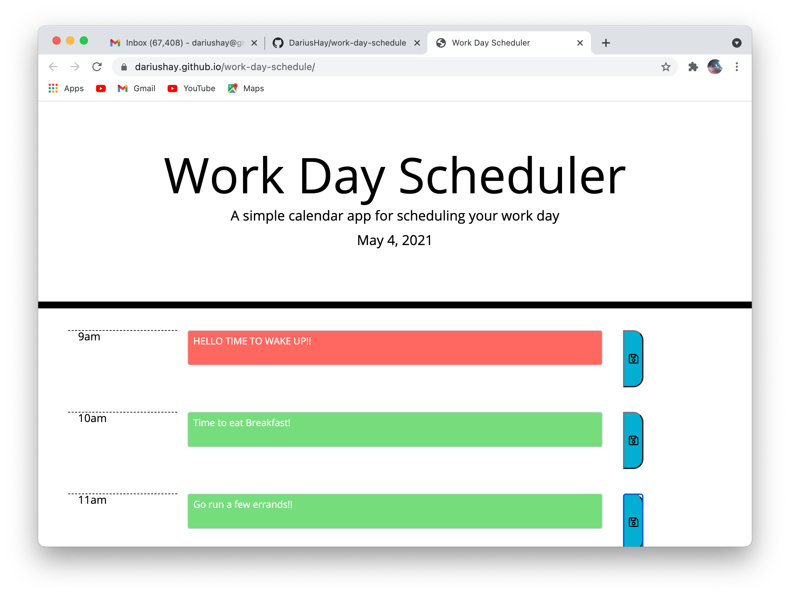

## Project Title

Workday Schedule

## Description

This schedule operates within the hours of 9am to 5pm. JQuery was used to notify the user when an hour was passed by changing the background color of that hour slot to grey. The current hour's time slot background color is red and the future time slot's background color is green. Local storage was also used to save each time slot's content to the user's page. 

## Table of Content

1. [Installation requirements](#Installation)
2. [Deployed App](#Deployed)
3. [Contributions](#contributing)
4. [screenshots](#Screenshots)
5. [Questions](#questions)

## Installation

HTML, JavaScript, JQuery, CSS, and Bootstrap 4.3.1 was used to create this workday schedule. 

## Deployed

https://dariushay.github.io/work-day-schedule/

# Screenshots

## Questions

If you have any additional questions about this project, you can find me on GitHub at DariusHay https://github.com/DariusHay, or you can email me at dariushay@gmail.com, thank you.