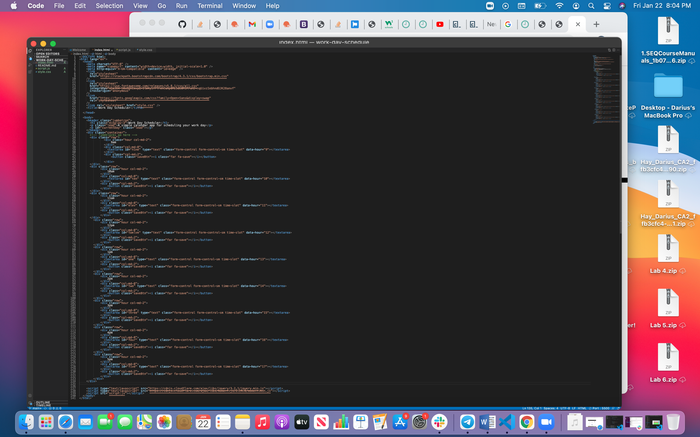
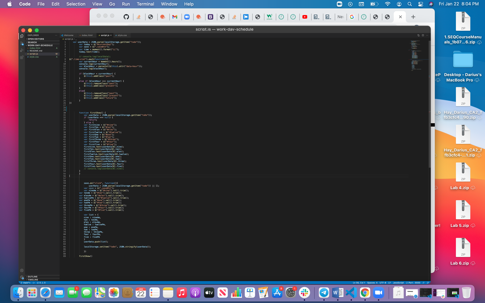
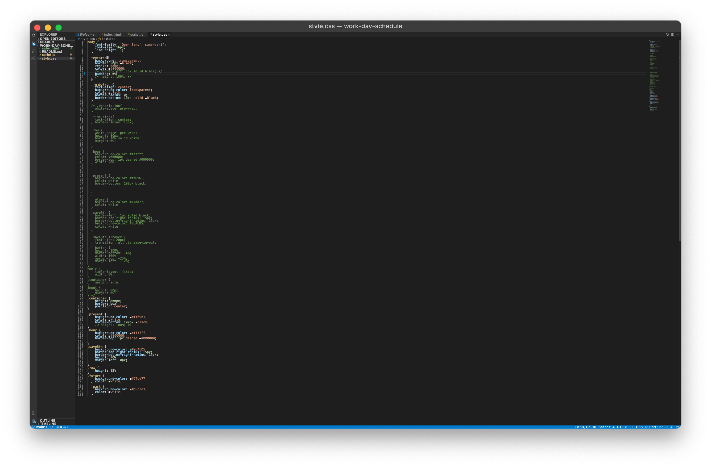

# work-day-schedule
In this project, html, javascript, jQuery and CSS was used to create a workday schedule. This schedule operates within the hours of 9am to 5pm. JQuery was used to notify the user when an hour was passed by changing the background color of that hour slot to grey. The current hour's time slot background color is red and the future time slot's background color is green. Local storage was also used to save each time slot's content to the user's page. 
# Screenshots

# URL
https://dariushay.github.io/work-day-schedule/